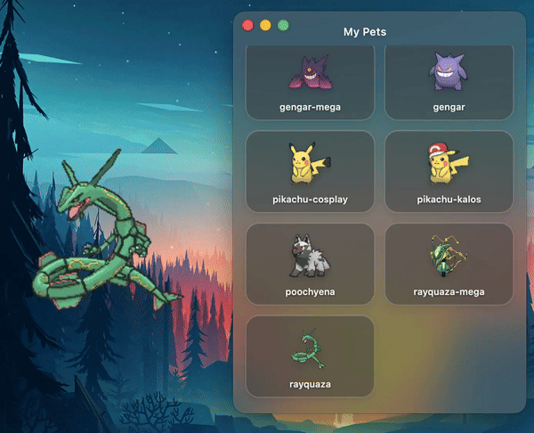

# MyScreenPets

Welcome to **MyScreenPets**! This is a desktop companion application built with Electron. Choose your favorite animated pets to roam around your screen, keep you company while you work, and react to your mouse cursor.

## Features

- **Multiple Characters**: Select from different pre-installed characters (like Pikachu, Gengar, Rayquaza) or easily add your own.
- **Customizable Behaviors**: Adjust the scale, walking style, speed, and opacity of your pet to fit your workspace perfectly.
- **Interactive**: Pets react to your cursor (stare, run away, or ignore).
- **Unobtrusive**: Pets roam freely on a transparent click-through window without interrupting your workflow.

## Character Selection and Editing

You can easily manage your companions using the built-in Settings Menu. To open the menu, simply press `Cmd + ,` (Command + Comma) or right-click on your pet.

### Choosing Your Pet
In the menu, you can select which pet you want to display on your screen. You can add new characters by clicking the "Add character" button and selecting any `.gif` file, or by dropping GIFs directly into the `characters` folder of the application.

#### Downloading Bonus Pokémon Sprites
If you want to access a massive library of Pokémon sprites (over 1600+ animated GIFs), you can use the included downloader script! 
Simply open your terminal, navigate to the project directory, and run:
```bash
node scripts/download-gifs.js
```
This will create a `pokemon-gifs` folder and download the sprites. You can then copy any GIFs you like from that folder into the `characters` folder to use them in the app!



### Customizing Appearance and Behavior
Clicking on an active character allows you to fine-tune how they look and act:
- **Size**: Scale your character up or down to make them tiny or giant.
- **Opacity**: Make your pet a solid figure or a subtle "ghost" outline.
- **Walking Style**: Choose how they move across your screen (e.g., bouncing, sliding).


### Interacting with Your Pet
Your screen pets are not just static animations! They can react to your cursor dynamically. Try moving your mouse around them and see how they respond.


## Getting Started

### Prerequisites
Make sure you have [Node.js](https://nodejs.org/) installed on your machine.

### Installation

1. Clone the repository:
   ```bash
   git clone https://github.com/GreyPikachu/MyScreenPets.git
   ```
2. Navigate to the project directory:
   ```bash
   cd MyScreenPets
   ```
3. Install dependencies:
   ```bash
   npm install
   ```

### Running the App
Start your desktop pet using:
```bash
npm start
```
*Note: You can also compile a native macOS `.app` bundle by running `npm run build:mac`.*
