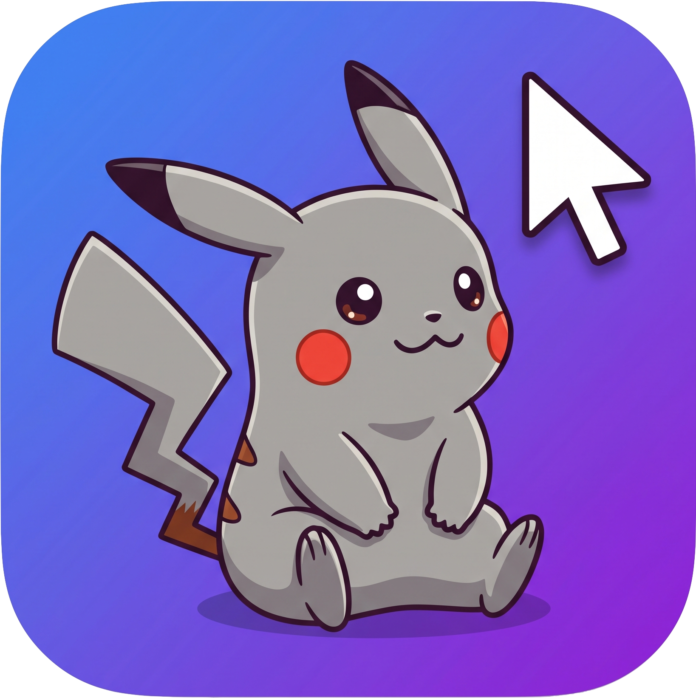
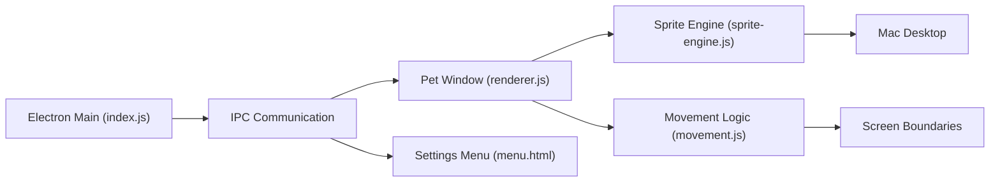

<p align="center">
  
</p>

# MyScreenPets

<p>
  
  
  
  
</p>

**MyScreenPets** is a desktop companion application for macOS built with Electron. Choose your favorite animated pets (like Pokémon) to roam freely on your screen, keep you company while you work, and react to your mouse cursor without interrupting your workflow.

## Available for macOS

<table>
  <tr>
    <td width="96">
      
    </td>
    <td>
      <strong>MyScreenPets</strong><br>
      Interactive desktop pets right on your screen. Fully transparent click-through windows, smart boundary bouncing, and fun cursor interactions.<br><br>
      <a href="https://github.com/GreyPikachu/MyScreenPets/releases">
        
      </a>
    </td>
  </tr>
</table>

## Showcase

<p align="center">
  
</p>
<br>
<p align="center">
  
  &nbsp;
  
</p>

## What's Inside

**Multiple Characters**

- Choose from built-in characters (Pikachu, Gengar, Rayquaza, etc.).
- Easily add your own: just drag and drop any `.gif` file into the app.
- Built-in script to download a massive database (1600+ animated Pokémon sprites).

**Deep Customization**

- **Size & Opacity:** Make your characters giant or turn them into semi-transparent ghosts.
- **Movement Styles:** Choose how they move (bouncing, sliding, or free-flying).
- **Trails:** Add beautiful particle effects (stars, hearts, music notes) that follow your pet.

**Interactivity**

- Smart cursor interaction: pets can look at your mouse, run away from it, or ignore it.
- Feeding system: right-click anywhere on the screen to drop food, and your pets will rush to eat it!
- Perfect edge bouncing tailored for macOS window boundaries and the menu bar.

**Technical Features**

- Transparent click-through windows (mouse events pass through empty space).
- Optimized rendering via Electron IPC and native macOS API calls.
- Runs above all windows without stealing focus, so you can keep working undisturbed.

## Tech Stack

<div align="center">
  
  
  
  
  
</div>

## Architecture Overview



## Getting Started (For Developers)

1. Clone the repository:
   ```bash
   git clone https://github.com/GreyPikachu/MyScreenPets.git
   ```
2. Navigate to the project directory:
   ```bash
   cd MyScreenPets
   ```
3. Install dependencies:
   ```bash
   npm install
   ```
4. Run the app:
   ```bash
   npm start
   ```
   *(You can also build a native `.dmg` for macOS by running `npm run build:mac`)*

## Downloading Bonus GIFs

You can download a database of 1600+ Pokémon sprites using the included script:
```bash
node scripts/download-gifs.js
```
The sprites will be saved to the `pokemon-gifs` folder, from where you can easily import them into the app.

## License

This project is licensed under the [MIT License](LICENSE).
